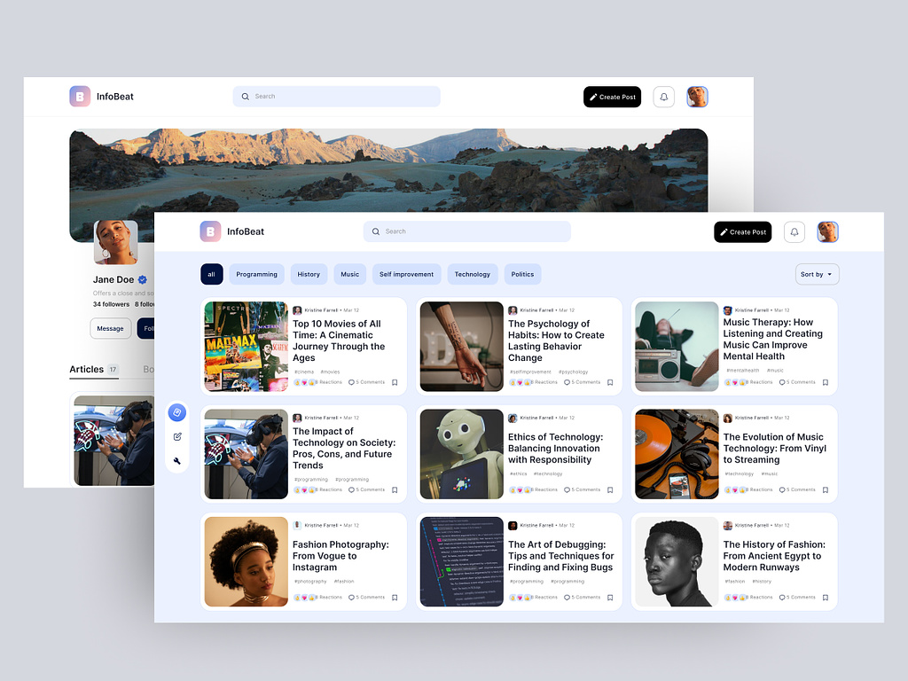

# :file_cabinet: Project React.js 02

<br>

## Description

<br>

## Table of contents

- [Description](#description)
- [Screenshot](#screenshot)
- [Links](#links)
- [Features](#features)
  - [1. main features](#1-main-features)
  - [2. extra features](#2-extra-features)
- [Technologies Used](#technologies-used)
  - [1. libraries](#1-libraries)
  - [2. others](#2-others)
- [Running the Project](#running-the-project)
- [VSCode Extensions](#vscode-extensions)
- [Folder Structure](#folder-structure)
- [Collaborators](#collaborators)
- [Git Flow](#git-flow)
  - [1. branches](#1-branches)
  - [2. pull requests](#2-pull-requests)
  - [3. commits](#3-commits)
- [Project Status](#project-status)

<br>

## Screenshot

[](https://dribbble.com/shots/21195999-InfoBeat-Article-blog-Web-App)

<br>

## Links

- Site URL in production: [URL](#)

<br>

## Features

Users should be able to:

### 1. main features

<!-- - [x] Ver todos os países da API na página inicial. -->

### 2. extra features

<br>

## Technologies Used

### 1. libraries

- [React.js](https://react.dev/learn/ "react.js documentation")

- [Next.js](https://nextjs.org/ "next.js documentation")

- [Tailwindcss](https://tailwindcss.com/ "tailwindcss documentation")

### 2. others

- [Sass](https://sass-lang.com/documentation/ "sass documentation")

- [Vite](https://vitejs.dev/guide/ "vite documentation")

<br>

## Running the Project

To run the repository on your machine, you will need to clone it and give the respective commands to start a project server through Vite:

```bash
npm install
```

```bash
npm run dev
```

<br>

## VSCode Extensions

It is also recommended to install the following extensions for project organization and standardization:

- [Prettier - Code formatter](https://marketplace.visualstudio.com/items?itemName=esbenp.prettier-vscode)

- [ESLint](https://marketplace.visualstudio.com/items?itemName=dbaeumer.vscode-eslint)

- [ES7+ React/Redux/React-Native snippets](https://marketplace.visualstudio.com/items?itemName=dsznajder.es7-react-js-snippets) *(optional)*

- [Todo Tree](https://marketplace.visualstudio.com/items?itemName=Gruntfuggly.todo-tree) *(optional)*

<br>

## Folder Structure

<br>

| Folder | Description |
| ---:   | :--- |
| `app/` | Each folder within the app folder becomes an accessible route in the app. Each folder must contain at least the **page.js** and **layout.js** files. |
| `components/` | Reusable application components. Components that are units for your application: **a button, a dropdown, a modal, etc**. |
| `contexts/` | contains the react.js API that allows you to share data between components without the need to pass props manually. |
| `hooks/` | This folder is used to store hooks that are generic and/or that interact with React hooks (useState, useEffect). Typically, they are reusable in any project, examples: **useScreenSize, useLocalStorage, useSessionStorage, useUserActive**. |
| `services/` | Here are the HTTP client configurations, normally using **axios**. |
| `utils/` | Utility functions like **formatCurrency, formatPhone, convertTimezone, parsePhone** (pure javascript). |

<br>

## Collaborators

<table>
  <tr>
    <!--  -->
    <td align="center">
      <a href="https://github.com/eriveltondasilva">
        <br>
        <sub>
          <b>Erivelton Silva</b>
        </sub>
      </a>
    </td>
    <!--  -->
    <td align="center">
      <a href="https://github.com/derciojds">
        <br>
        <sub>
          <b>Dercio João</b>
        </sub>
      </a>
    </td>
    <!--  -->
    <td align="center">
      <a href="https://github.com/eriveltondasilva">
        <br>
        <sub>
          <b>Erivelton Silva</b>
        </sub>
      </a>
    </td>
    <!--  -->
  </tr>
</table>

<!-- | | | |
| :---: | :---: | :---: |
|  |  |  |
| [Erivelton Silva](https://github.com/eriveltondasilva) | [Erivelton Silva](https://github.com/eriveltondasilva) |
| | | -->

<br>

## Git Flow

### 1. branches

> main -» branch in production

> dev -» branch for development

Local branches must follow the standard:
*<iniciais_do_colaborador/identificador_da_task/título_da_task>*

Example:
> WA/TASK-130/Página_de_Detalhes

### 2. pull requests

Each change must be made from PR's.
Devs must checkout the `branch dev` and create a PR for it (`branch dev`).

After the PR is approved, the PR creator must merge (`squash and merge`) and delete their branch.

### 3. commits

It was agreed that we will not follow the standard, only that the commits must be in English.

<br>

## Project Status

:heavy_check_mark: Project initialized (2023-25-10).
<!-- :rocket::tada::tada: -->

<br>
